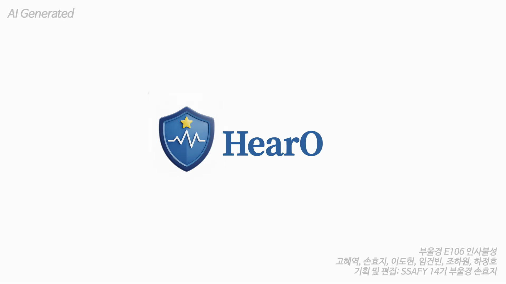
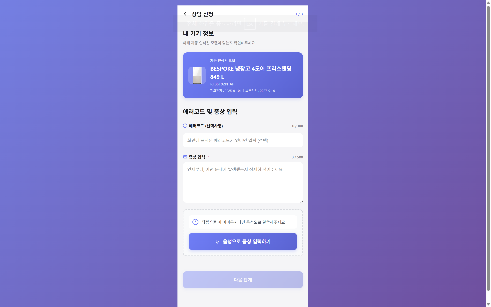
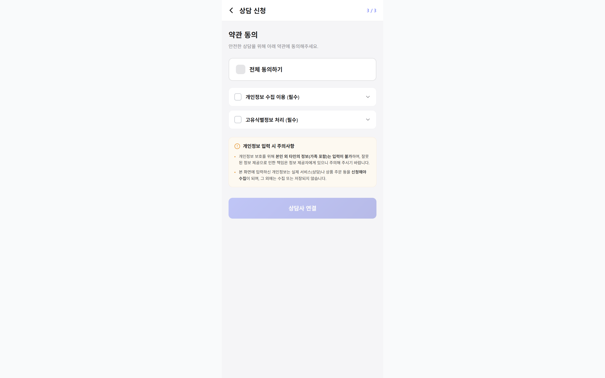
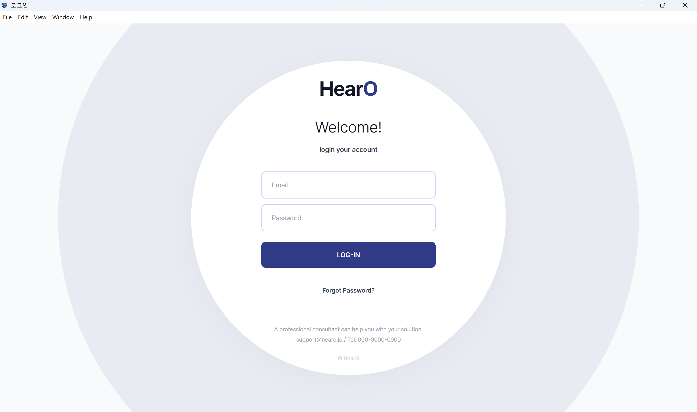
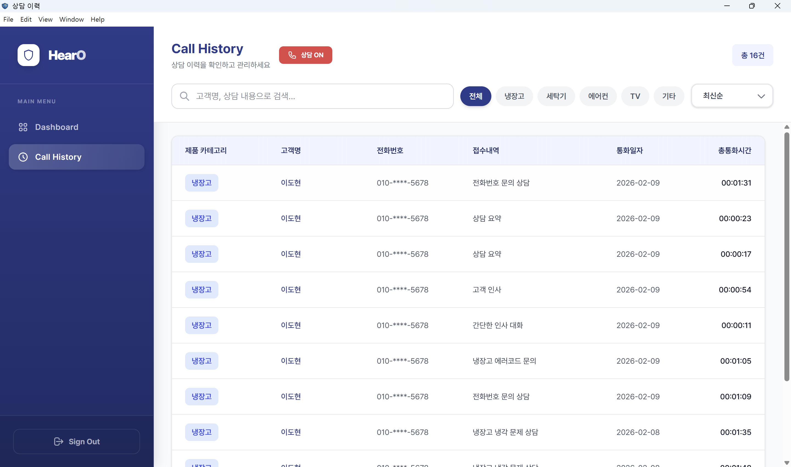
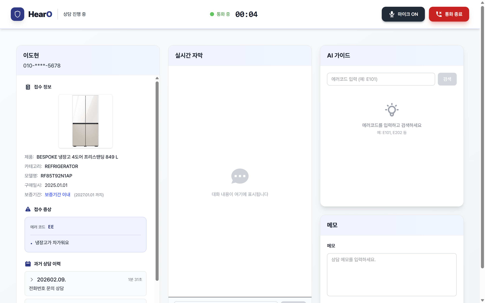
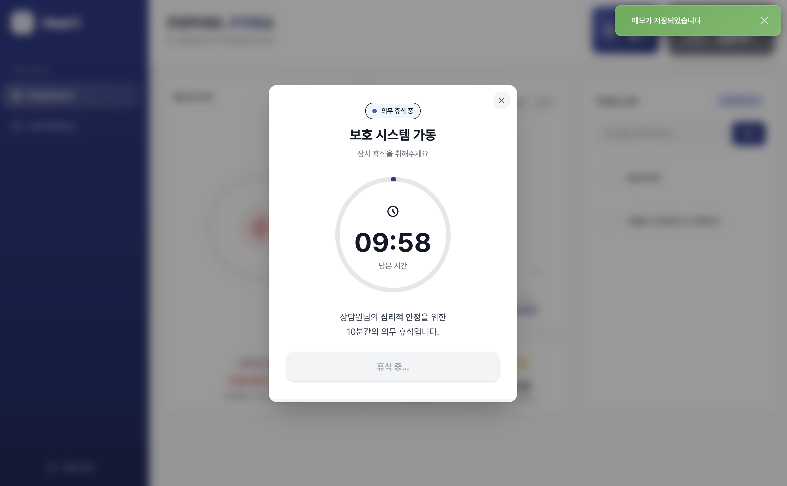
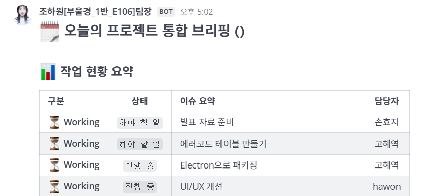

# 🔊 HearO

## HearO(히어로) 소개 영상
[](https://youtu.be/nMwnU2cHt6A?si=-cwvcjxkH1D69FxP)

<br>
<br>

**AI 기반 상담원 보호 및 실시간 상담 지원 서비스**

HearO는 AS 콜센터 상담원을 대상으로,
폭언·욕설 환경으로부터 상담원을 보호하고 상담 품질을 향상시키기 위한
실시간 AI 통화 지원 플랫폼입니다.

WebRTC(LiveKit) 기반 1:1 음성 통화 위에
폭언 마스킹, STT(Speech-To-Text), 욕설·폭언 감지, 상담 가이드 자동 제공(RAG),
상담 요약 및 스트레스 지수 산정 기능을 결합하여
상담원이 안전하게, 그리고 효율적으로 상담에 집중할 수 있는 환경을 제공합니다.

> 모두가 존중받으며 일할 수 없을까?
상담원의 곁에 항상 함께하는 히어로, HearO

---

## 📅 프로젝트 정보

- 개발 기간 : 2026.01.12 ~ 2026.02.08 (5주)
- 플랫폼 : Web (PC Web)
- 개발 인원 : 6명
- 기관 : 삼성 청년 SW·AI 아카데미 (SSAFY)

---

## 🔎 목차

[🌟 팀원 구성](#-팀원-구성)

[🛠️ 기술 스택](#️-기술-스택)

[🌐 시스템 아키텍처](#-시스템-아키텍처)

[📲 기능 구성](#-기능-구성)

[📂 디렉터리 구조](#-디렉터리-구조)

[📦 프로젝트 산출물](#-프로젝트-산출물)

---

## 🌟 팀원 구성

### 🎨 Frontend

- 조하원 (Team Leader, Frontend)
- 이도현 (Frontend & Docs)
- 손효지 (Frontend & Speaker)

### 🧠 Backend / Infra / AI

- 하정호 (Backend & Infra)
- 임건빈 (Backend)
- 고혜역 (Backend & AI)

> ※ 역할 세부 분담은 Jira 및 산출물 문서 참고

---

## 🛠️ 기술 스택

### 🌕 Frontend

| Category         | Stack                   |
| ---------------- | ----------------------- |
| Language         | JavaScript / Python     |
| Framework        | Vue 3                   |
| State Management | Pinia                   |
| Real-time        | WebSocket               |
| UI               | HTML5, CSS3             |
| IDE              | Visual Studio Code      |

---
### 🌑 Backend

| Category  | Stack                |
| --------- | -------------------- |
| Language  | Java 17              |
| Framework | Spring Boot          |
| Security  | Spring Security, JWT |
| Database  | PostgreSQL / Redis          |
| API Docs  | Swagger(OpenAPI)     |
| IDE       | IntelliJ IDEA        |

---

### 🤖 AI
| Category  | Stack              |
| --------- | ------------------ |
| Language  | Python             |
| Framework | FastAPI            |
| AI API    | OpenAI API         |
| STT       | Whisper 기반 STT     |
| NLP       | 상담 요약, 욕설 분석       |
| IDE       | Visual Studio Code |

---

### ⚙️ DevOps / Infra

| Category   | Stack                  |
| ---------- | ---------------------- |
| Container  | Docker, Docker Compose |
| Web Server | Nginx                  |
| WebRTC     | **LiveKit**            |
| Cloud      | AWS EC2                |
| CI/CD      | Jenkins                |

---

## 🌐 시스템 아키텍처
### 🖧 System Architecture

- WebRTC(LiveKit)를 통한 실시간 음성 통화
- STT → OpenAI 분석 → UI 반영의 비동기 파이프라인
- 통화 종료 이벤트 기준 데이터 자동 저장

### 🚀 CI/CD Architecture

- Git 기반 자동 빌드 및 배포
- 컨테이너 기반 서비스 분리 운영

---

## 📲 기능 구성
### 🔑 고객 & 상담 흐름
- QR 기반 고객 접수
- 상담 대기열 관리 및 자동 배정
- 블랙리스트 기반 스마트 매칭

### 📞 실시간 통화
- LiveKit 기반 1:1 음성 통화
- 상담원 상태(대기/통화/휴식) 관리

### 🧠 AI 상담 지원
- 실시간 STT 자막 제공
- 욕설·폭언 감지시 음성 마스킹
- 욕설·폭언 감지 및 시각적 경고
- 욕설 누적 시 AI 상담사 자동 전환
- 상담 가이드 자동 표시 (RAG)

### 🧾 상담 기록 관리
- 상담 내용 자동 저장
- AI 기반 상담 요약 생성
- 상담 이력 조회 및 상세 보기

### 🧘 상담원 보호
- 스트레스 지수 산정
- 휴식 권장 및 강제 휴식 모달

---

## 📂 디렉터리 구조

```
📦 HearO
┗ 📂 ai
 ┣ 📂 frontend
 ┃ ┣ 📂 src
 ┃ ┗ 📂 public
 ┣ 📂 backend
 ┃ ┣ 📂 src
 ┣ 📂 infra
 ┗ 📂 docs
 ```

## 📦 프로젝트 산출물

### 📲 기능 화면

#### 고객 화면

#### 1. 고객 첫 화면 랜딩
- QR을 통해 증상을 접수합니다.
- QR에 제품 정보가 자동으로 입력되어 있습니다.



#### 2. 본인 확인
- 고객은 본인 인증 후 상담사와 연결할 수 있습니다.


#### 3. 개인정보 동의 화면


#### 4. 통화 대기 화면
- 앞에 몇 명이 대기하는 지 볼 수 있습니다.


#### 5. 통화 화면

---

#### 1. 일렉트론


#### 2. 로그인 화면


#### 3. 메인화면


#### 4. 통화 이력
- 해당 상담사와 통화했던 과거 이력을 한 눈에 볼 수 있습니다




#### 5. 고객 매칭


#### 6. 통화 화면
- 통화 첫 랜딩페이지 입니다



#### 7. 고객 과거 이력
- 통화 화면에서 고객의 과거 이력을 볼 수 있습니다


#### 8. RAG 기반 AI 가이드
- RAG를 통해 에러코드를 검색하여 증상을 볼 수 있습니다


#### 9. 통화 종료 화면
- 통화 종료 시 AI가 통화 내역을 요약해줍니다
- 상담사는 기존에 썼던 메모를 이어서 쓸 수 있습니다


#### 10. 의무 휴식 모드
- 상담사의 에너지가 0이 되면 의무 휴식 모드에 들어갑니다




### 📹 시연 영상(Video Portfolio)

- 기능을 한 눈에 볼 수 있는 영상입니다.
- [HearO](https://www.youtube.com/watch?v=M1t-3sclflQ)


### 🖼️ 화면 설계서(UI/UX)


### 🗄️ ERD
.png>)

### ✅ Swagger API Docs

### 📋 기능 명세서

### 📡 API 명세서

### 📅 Jira 이슈 관리 내역

#### 1. 지라 자동화를 통한 알림 


#### 2. 