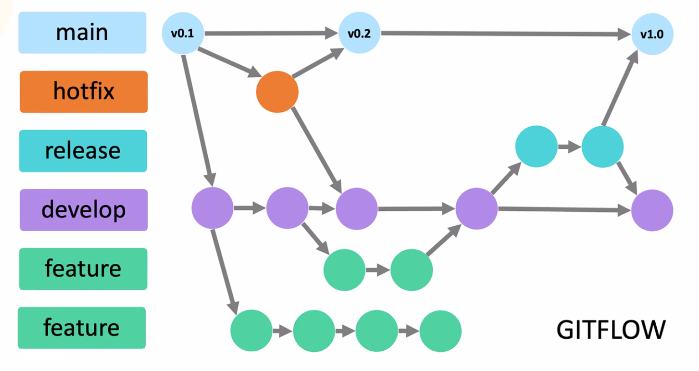
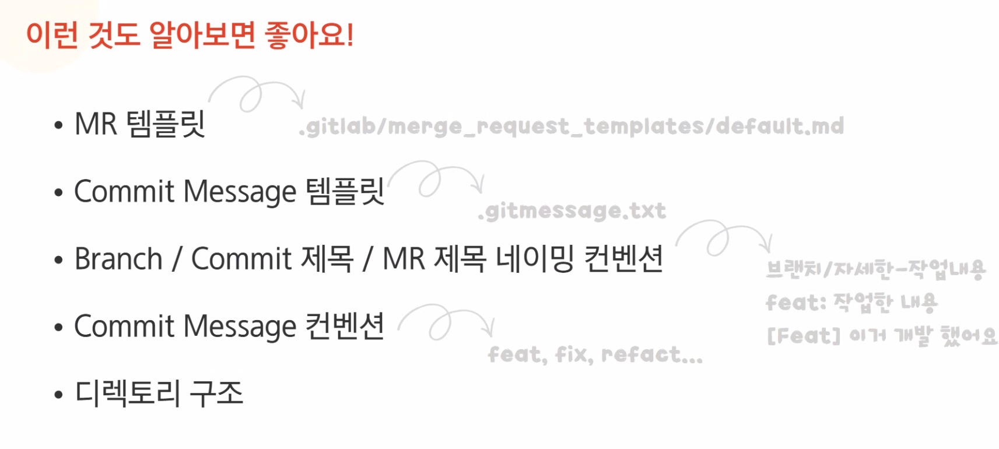

# GIT FLOW

# Branch : 나뭇가지, 분기

독립적인 개발 공간

병렬 개발로 협업에 유리 

작업 기록에도 유리 

## Branch 전략이 왜 필요한데?

git 충돌 .. 등등 

# Git Flow

master : 사용자에게 배포

release : 배포 전 최종 버그 수정 및 점검

develop : 다음 버전 출시를 위해 개발을 진행

feature : 새로운 기능을 개발

hotfix : 배포 중인 서비스에서 급한 버그 수정

### SSAFY Git Lab 에서는 1개의 레포지토리만 활용이 가능함

정석적인 방법 vs 파트별로 영역을 나누는 방법

## 파트별

장점 : merge 할 때 충돌 감소소

단점 : 관리해야 할 브랜치가 많아짐

1. release branch 
    
    다음 버전 개발과 현재 버전 배포 준비를 동시에 할 때
    
    앱스토어 심사, 정기적인 배포가 필요한 경우
    
2. hotfix Branch
    
    현재 배포 중인 버전에서 버그가 발생하여 급하게 적용해야 할때
    

